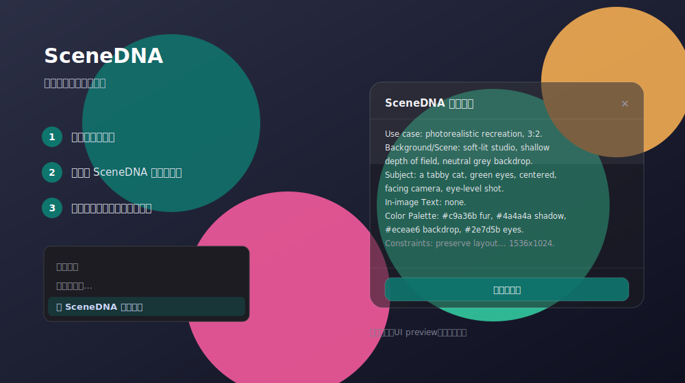

# SceneDNA

[](LICENSE)


**SceneDNA** 是一个本地优先的浏览器图片解析工具。在网页图片上点击右键，它提取场景、主体、构图、文字、色彩和约束，生成用于 AI 图像创作的结构化提示词。



## 工作方式

```text
右键网页图片
  → SceneDNA 读取图片
  → 调用你配置的 OpenAI 兼容视觉模型
  → 生成高信息密度的复现提示词
  → 在当前页面展示并一键复制
```

SceneDNA 不使用开发者中转服务器。API Key 仅保存在 `chrome.storage.local`，图片与 Key 只会发送到你在设置中指定的 API 服务。

## 安装

1. 下载或克隆本仓库。
2. 打开 Chrome 的 `chrome://extensions`。
3. 开启「开发者模式」，点击「加载已解压的扩展程序」。
4. 选择本仓库的 `extension/` 目录。
5. 打开 SceneDNA 设置，填写 API Key、视觉模型和 API 地址。
6. 在任意网页图片上右键，选择「用 SceneDNA 解析图片」。

### 配置项

| 配置 | 默认值 | 存储位置 | 说明 |
|---|---|---|---|
| API Key | 空 | `chrome.storage.local` | 必填，仅保存在当前浏览器设备 |
| 视觉模型 | `gpt-5.5` | `chrome.storage.sync` | 使用 API 服务支持的视觉模型名称 |
| API 地址 | `https://aihubmix.com/v1` | `chrome.storage.sync` | OpenAI 兼容接口的 `/v1` 基础地址 |

## 项目结构

```text
extension/                  Chrome Manifest V3 扩展源码
  manifest.json             扩展清单
  background.js             右键菜单、抓图和模型调用
  content/overlay.{js,css}   结果浮层
  popup.html / popup.js      快速设置
  options.html / options.js  完整设置
store/                       应用商店文案与隐私政策
docs/preview.svg             界面预览
```

## 说明

图片转提示词是有损过程，无法保证完全还原原图。人脸、复杂排版、小字和隐藏细节仍可能出现偏差。

## 常见问题

- **右键菜单没有出现**：在 `chrome://extensions` 中重新加载扩展，再刷新目标网页。
- **提示 Key 无效**：确认 Key 属于当前填写的 API 服务，并在设置页点击“测试连接”。
- **提示模型不存在**：把视觉模型改为 API 服务实际支持的模型名称。
- **图片抓取失败**：部分图床启用了防盗链；可换一张图片，或先保存图片再从本地页面打开。
- **网页无法注入浮层**：Chrome 内置页、扩展商店等受保护页面不允许扩展注入脚本，请在普通网页中使用。

## License

[MIT](LICENSE)
